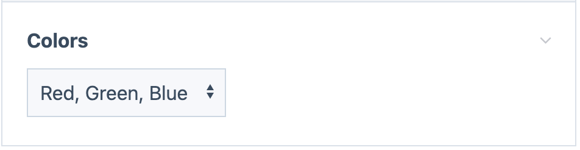
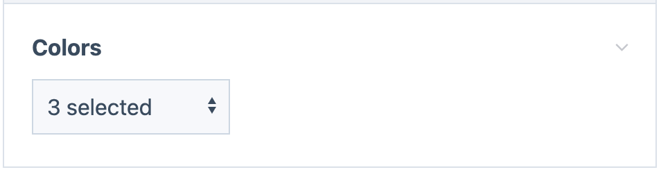
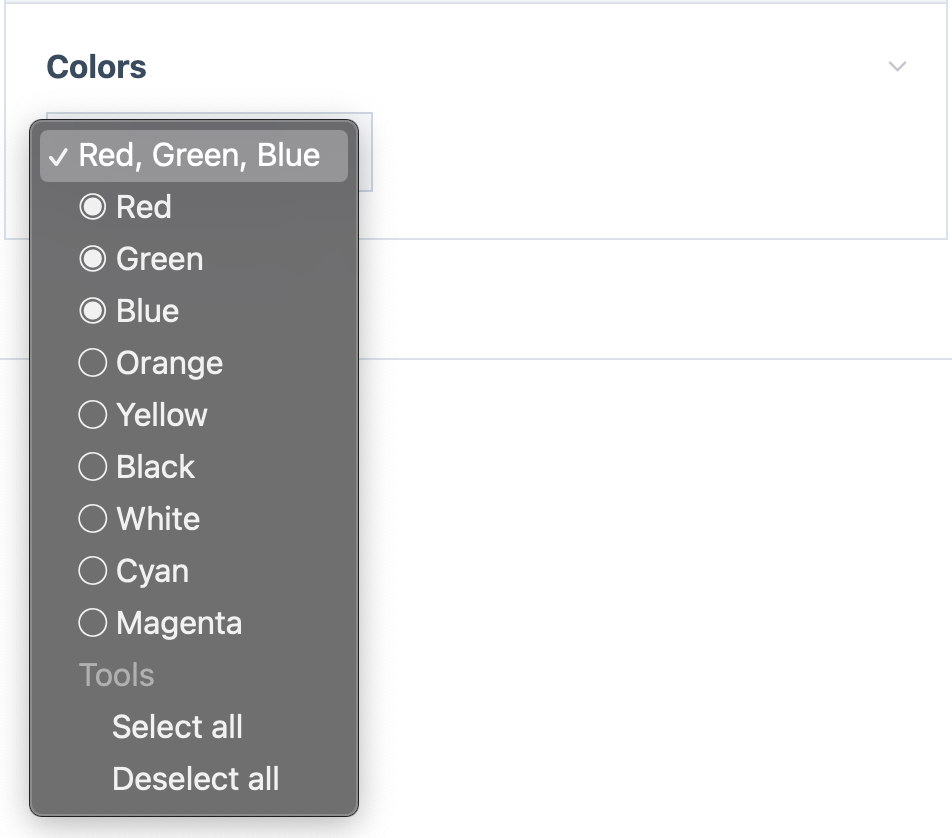
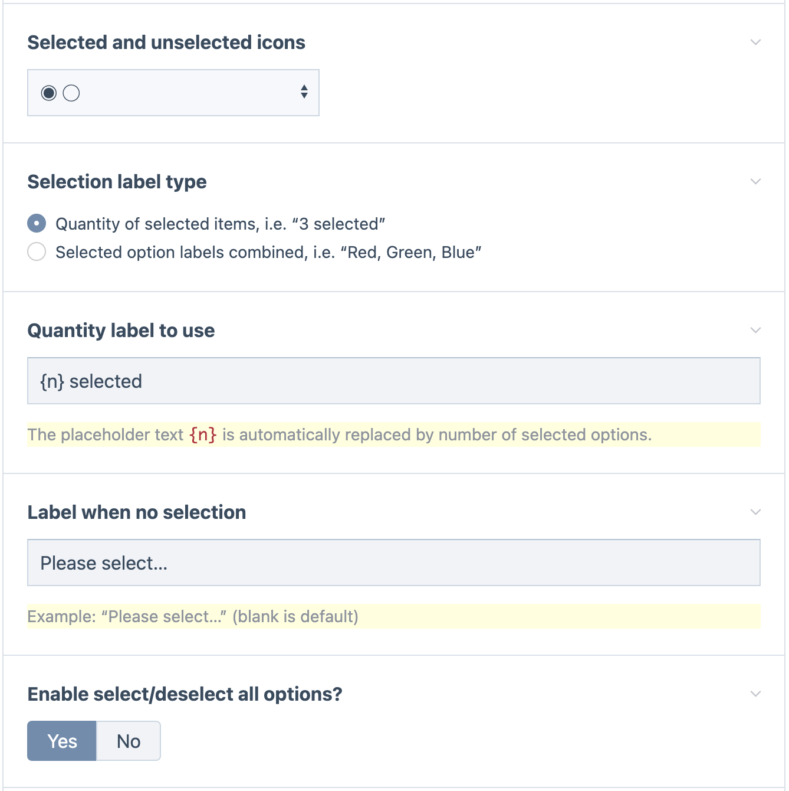

# Small Select Multiple Inputfield for ProcessWire

A lightweight Inputfield that adds multiple selection ability to the regular browser native 
single `<select>`. It is simpler and easier to use than a normal select multiple. 

The goal was to have a multi-selection input that was as simple as single-selection input, and
that didn't introduce new UI elements, sticking just to native browser controls. 

It works the same as a regular single `<select>`in how you make a selection. Selected items are indicated
by a check or radio button (or something else if you configure it). Clicking a selected item de-selects it.

## More details

- It provides multiple selection while taking up no more space than a regular single select. 
 
- Selected versus non-selected state is indicated by using UTF-8 checkbox or radio button icons,
  or whatever indicator you want to use (whether UTF-8 icons or text). 

- Has a simpler presentation than other multiple selection options, making it ideal for large 
  forms with lots of inputs that might otherwise look complex. 
 
- Also good for cases where vertical space may be limited. 
- Unlike AsmSelect (our other custom multi-selection widget) the input does not grow vertically 
  as additional options are selected, making it good for cases where vertical space may be limited.
 
- The label for the select can either indicate the quantity of items selected, or it can present
  a CSV list of selected items. 
 
- Provices the ability to select-all or deselect-all.

- This module extends InputfieldSelectMultiple and can be substituted anywhere that module is used.
 
- The most common use cases would be with ProcessWire SelectOptions and Page fields. It can also
  be used with FormBuilder or any other InputfieldForms. It can also be used outside of ProcessWire forms.

## Installation 

1. Copy all the files for this module into /site/modules/InputfieldSmallSelectMultiple/.
2. In your admin go to Modules > Refresh. 
3. Find this module on your Modules “Site” tab and click “Install”.

### Usage in fields:

- **Options fields:**  
Create a new field using the “Select Options” and select “Small Select Multiple”
as the input type.

- **Page fields:**   
Create a new field using the “Page Reference” type. On the “Input” tab, select 
“Small Select Multiple” as the Input type. If you do not see the option available, edit
your InputfieldPage module settings and add “Small Select Multiple” as an allowed type.

- **Other types:**  
You should see the option to use “Small Select Multiple” anywhere that you see ProcessWire’s 
other multiple selection types available. 

## Screenshots

Closed state, indicating selected options:

Closed state, indicating quantity of items selected:

Opened state to make selection (actual appearance will depend on browser and platform):

Settings screen:

